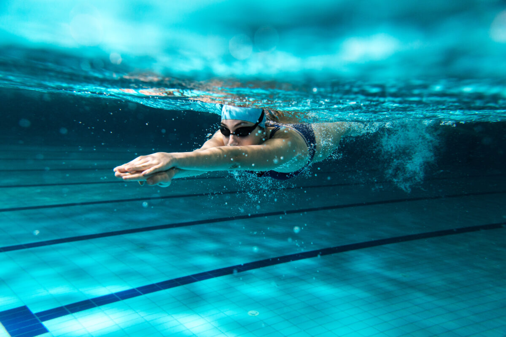

## Swimming

<p>App for swimmers follow evolution and objectives personal</p>

<h1 align="center">
  
</h1>

## Summary

<!--ts-->

- [About](#swimming)
- [Summary](#summary)
- [Features](#features)
- [Pre requirements](#pre-requirements)
- [Installation](#installation)
- [Autor](#autor)
- [License](#license)
<!--te-->

<h4 align="center"> 
	🚧  Swimming 🚀 Building...  🚧
</h4>

## Features

- [ ] Insert your training
- [ ] Update your training
- [ ] Delete your training
- [ ] Integration your training with Apple Watch
- [ ] Notifications in your cellphone

## Pre-requirements

Before start this project, you need installed in your computer that tools:
[Git](https://git-scm.com), good code editor how [VSCode](https://code.visualstudio.com/) and all the environment [React Native](https://reactnative.dev) with [Expo](https://expo.dev).

## Installation

1. Repositorie clone

   ```bash
   git clone https://github.com/leandrovidal56/swimming.git
   ```

2. Install dependencies

   ```bash
    yarn install
   ```

3. Run project

   ```bash
    yarn expo start
   ```

## Autor
<a href="https://blog.rocketseat.com.br/author/thiago/">
 
 <br />
 <sub><b>Leandro Vidal</b></sub></a></a>


 👋🏽 Talk to me!

 [](https://www.linkedin.com/in/leandrovidalsilva/) 
[](mailto:leandrovidal56@gmail.com)

## License
This project is under the license [MIT](./LICENSE).

